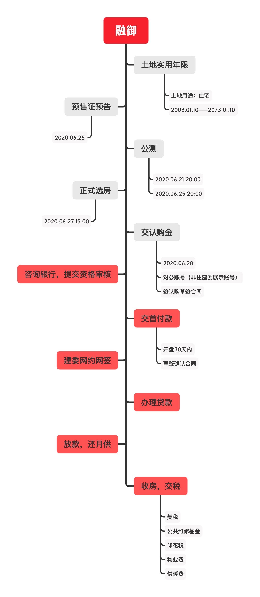

# 融御
  > 副中心扛把子融御相关信息汇总  
  资料内容大部分来源于群友吃瓜唠嗑  
  真真假假，全凭各位看官自己几分相信  
  图片来自网络，侵权删  
  

*   [一：融御项目介绍](#一：融御项目介绍)
    *   [1.时间线](#时间线)
    *   [2.住建委](#住建委)
	  *   [3.项目宣传](#项目宣传)
*   [二：关于房子要知道的一些事情](#关于房子要知道的一些概念)
    *   [1.户型图](#用地性质)
    *   [2.小面积大学问](#容积率)
    *   [3.买房时定金 订金 诚意金 认筹金 区别](#买房时定金订金诚意金认筹金区别)
    *   [4.车位](#绿化率多少合适住宅小区绿化率标准)
    *   [5.储物间](#楼层净高)
    *   [6.公摊面积](#为什么每层住宅楼层默认高是在3米左右？)
*   [三：地铁交通规划与现状](#地铁交通规划与现状)
*   [四:关于学区](#关于学区)
*   [五: 配套设施分析(道路，医院，学校，综合体)](#配套设施分析)
    *   [1.综合体](#综合体)
    *   [2.学校](#学校)
    *   [3.医院](#医院)
    *   [4.体育设施](#体育设施)

## <a name="一：融御项目介绍">一：融御项目介绍</a>

### 1.<a name="时间线">时间线</a>

### 2.<a name="住建委">住建委</a>

### 3.<a name="项目宣传">项目宣传</a>
